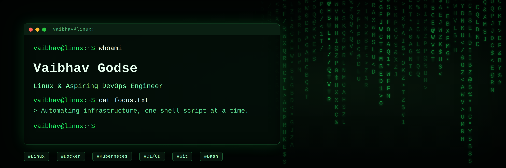

 

<h1 align="center">
Hi, I'm Vaibhav Godse 👋
</h1>

<h3 align="center">
Linux & Aspiring DevOps Engineer
</h3>

## 👨‍💻 About Me

- 💼 **Experience:** Former Engineer at **Aress Software** with 1 year of hands-on experience in Linux and environment management.
- 🛠️ **Current Focus:** Deepening my knowledge in **DevOps**, Cloud Infrastructure, and Automation.
- ⚡ **Tech Stack:** Linux, Docker, Kubernetes, Git, GitHub, Bash, Python & Java.
- 🎯 **Goal:** Building scalable, automated CI/CD pipelines and infrastructure as code.
- 📫 **Connect with me:** [LinkedIn](https://www.linkedin.com/in/vaibhavgodse16122002)

## 🛠️ Tech Stack

### ☁️ Cloud & DevOps

  

### 💻 Programming & Scripting

  

### 🐧 Operating Systems, Databases & Tools

  

### 📊 Monitoring & Observability

  

---

## 📚 Currently Learning

- Kubernetes Fundamentals
- Advanced Terraform Modules & Best Practices
- Monitoring & Observability
- Production-grade CI/CD Pipelines
- Infrastructure Automation
- Cloud Security Best Practices

---

## 🌱 Currently Building

- Production-ready Cloud Infrastructure projects.
- CI/CD pipelines using GitHub Actions.
- Terraform-based AWS infrastructure deployments.
- Linux administration and troubleshooting labs.
- Technical documentation for Cloud & DevOps concepts.
  
---

## 📌 Featured Projects

### 🚀 90 Days of DevOps

> My hands-on Cloud & DevOps learning journey.

- [90DaysOfDevOps](https://github.com/vaibhavg16/90DaysOfDevOps-2026/tree/master)

---
